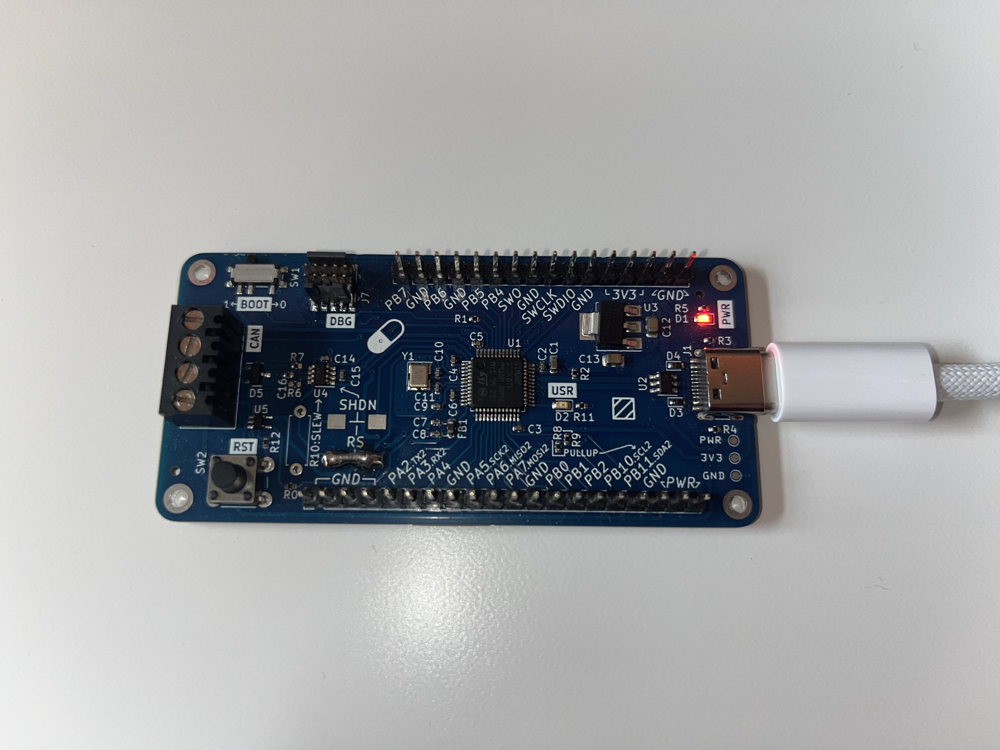

# canpill
Canpill is a basic development board based on Phil's Lab stm32 blue pill adaptation (https://www.youtube.com/watch?v=aVUqaB0IMh4). The board uses an STM32F103C8 microcontroller.

This repository contains the kicad project files and some basic software for the board.

## Image

- Board manufactured before R13 was added

## Additions
- A CAN transceiver with screw terminal interface
- Additional header IO breakout
- 10 pin J-Link compatible connector
- Modified layout
